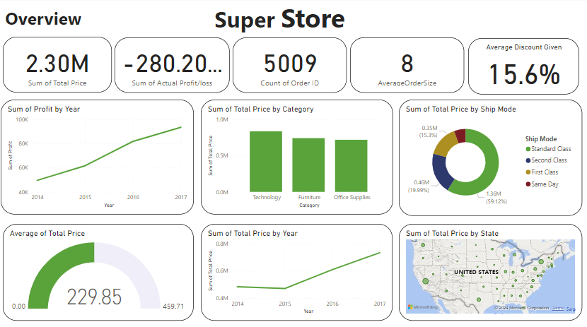

# Sales Dashboard 
Track key metrics such as total sales, sales by region, product performance, and sales trends over time.

Three pages:
- Overview Page
- Sales Analysis Page
- Profitability Page
- Customer Insights Page

# Dataset:
https://www.kaggle.com/datasets/vivek468/superstore-dataset-final

## Dataset preview:
### - Total Columns: 21
    - Row ID
    - Order ID
    - Order Date
    - Ship Date
    - Ship Mode
    - Customer ID
    - Customer Name
    - Segment
    - Country
    - City
    - State
    - Postal Code
    - Region
    - Product ID
    - Category
    - Sub-Category
    - Product Name
    - Sales
    - Quantity
    - Discount
    - Profit
### - Data size : 9994

# Data Cleaning:
- Drop 'Row ID' Column
- Drop Duplicates
- Rename 'Sales' to 'Total Price'
####  7 New Columns are added 
    - Before Discount
    - Sale Price
    - Product Price
    - Margin 
    - Product Price X Quantity
    - TotalQuantityPerOrder
    - Actual Profit/Loss
### - Data size: 9965

# Data Exploration:
This dataset only use 'United Sates' Data 
- Total Cities: 531
- States: 49
- Region: Central , East , South , West

### Before Discount:
Before Discount = 'Sample - Superstore'[Total Price]/(1-'Sample - Superstore'[Discount])

### Sale Price:
Sale Price = 'Sample - Superstore'[Before Discount]/'Sample - Superstore'[Quantity]

### Product Price
Product price = ('Sample - Superstore'[Before Discount]-'Sample - Superstore'[Profit])/'Sample - Superstore'[Quantity]

### Margin:
Margin = 'Sample - Superstore'[Sale Price]-'Sample - Superstore'[Product price]
### Product Price X Quantity:
Product Price X Quantity = 'Sample - Superstore'[Product price]*'Sample - Superstore'[Quantity]
### TotalQuantityPerOrder:
TotalQuantityPerOrder = 
CALCULATE(
    SUM('Sample - Superstore'[Quantity]),
    ALLEXCEPT('Sample - Superstore', 'Sample - Superstore'[Order ID])
)
### Actual Profit/Loss:
Actual Profit/loss = 'Sample - Superstore'[Total Price] - 'Sample - Superstore'[Product Price X Quantity]

## Measures:
 ###  Retention Rate
 Retention Rate = 
VAR CurrentMonthCustomers = DISTINCTCOUNT('Sample - Superstore'[Customer ID])
VAR RetainedCustomers = 
    CALCULATE(
        DISTINCTCOUNT('Sample - Superstore'[Customer ID]),
        FILTER(
            ALLSELECTED('Sample - Superstore'),
            'Sample - Superstore'[Order Date] <= MAX('Sample - Superstore'[Order Date])
        )
    )
RETURN
    DIVIDE(RetainedCustomers, CurrentMonthCustomers, 0)

### Loss Due to Discount
Loss Due to Discount = 
CALCULATE (
    SUMX (
        'Sample - Superstore',
        IF (
            'Sample - Superstore'[Actual Profit/loss] < 0,
            'Sample - Superstore'[Discount],
            0
        )
    )
)

### AverageOrderSize:
AverageOrderSize = 
AVERAGEX(
    VALUES('Sample - Superstore'[Order ID]),
    CALCULATE(SUM('Sample - Superstore'[Quantity])
)
)

# Overview Page:

# Sales Analysis Page:

# Profitability Page:

# Customer Insights Page:

